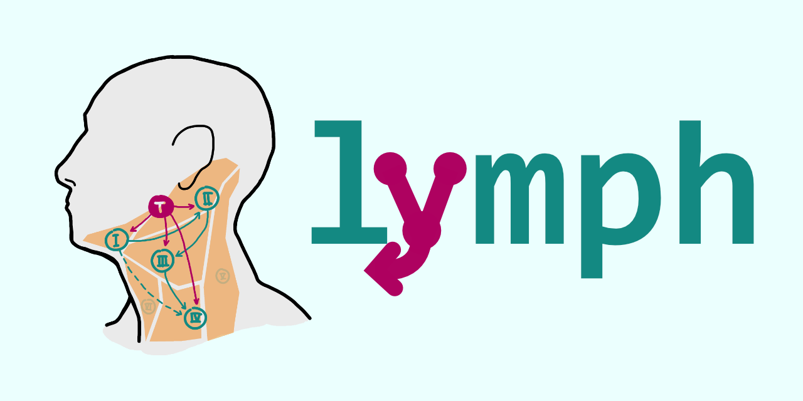

# The `lymph` package

**Python package for statistical modelling of lymphatic metastatic spread in head & neck cancer.**

## Motivation

Squamous cell carcinoma in the head & neck region (HNSCC) frequently metastasises through the lymphatic system. For this reason and as part of radiotherapy, large parts of the lymphatic system get irradiated prophylactically, based on the empirical prevalence of metastatic lymph node levels (LNLs), see e.g. [(Bauwens et al., 2021)](https://www.doi.org/10.1016/j.radonc.2021.01.028).

We believe that this elective nodal irradiation can be personalized using probabilistic models and datasets that report the detailed patterns of lymphatic involvement for cohorts of patients, instead of just the prevalence.

The first aspect is addressed in our recent publications where we first used Bayesian networks [(Pouymayou et al., 2019)](https://www.doi.org/10.1088/1361-6560/ab2a18) and later hidden Markov models [(Ludwig et al., 2021)](https://www.doi.org/10.1038/s41598-021-91544-1). **This package provides the python implementation for the two models described in these publications.**

To tackle the second issue of publicly available data with enough detail, we began by extracting a dataset at our institution, the University Hospital Zurich, and will publish it shortly on a designated website [www.lyprox.org](https://www.lyprox.org), where one can visually explore the data in our dashboard. By doing so, we hope to motivate other researchers to share their data in a similar fashion, so we can expand this platform further. **If you would like to join our effort, feel free to [contact us](mailto:roman.ludwig@usz.ch).**

## The code

The implementation is pure-python and has only a few dependencies. However, it is intended to be used with powerful inference algorithms, e.g. the great sampling package [`emcee`](https://github.com/dfm/emcee), which we used for our results.

We documented the API of the package, as well how we obtained the results of our [paper](https://www.doi.org/10.1038/s41598-021-91544-1) of the hidden Markov model publication [here](https://lymph-model.readthedocs.io).
